# QuickEdit CLI Flow Explained

This guide explains how the `quickedit` command works from the moment you run it
to the moment it writes an edited video. It uses simple language first, then
adds the technical detail needed to understand each stage.

## One sentence summary

QuickEdit looks at your video, finds parts worth keeping, builds a cut list, and
uses FFmpeg to render a new video from the kept parts.

## Big picture diagram

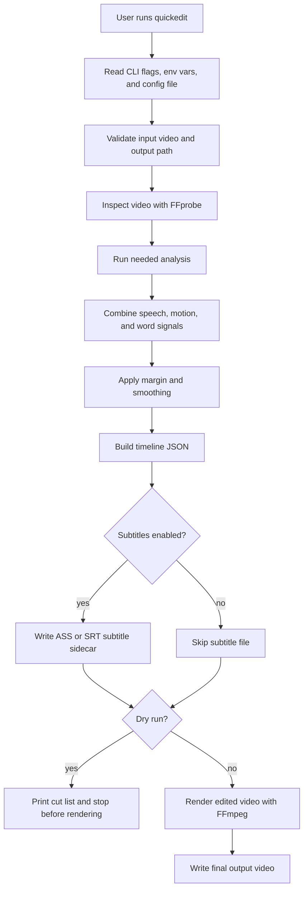

## What files QuickEdit creates

For an input named `recording.mp4`, QuickEdit normally writes:

| File | What it is |
| --- | --- |
| `recording_edited.mp4` | The final edited video. |
| `recording_edited.timeline.json` | A machine-readable list of kept clips and cut sections. |
| `recording_edited.ass` | Fancy subtitles, if `--subtitle-style fancy` is used. |
| `recording_edited.srt` | Simple subtitles, if `--subtitle-style simple` is used. |
| `.quickedit_cache/` | Cached analysis data stored beside the input video. |

If you use `--dry-run`, QuickEdit writes the timeline and possible subtitle
sidecar, but it does not render the final video.

## Command shape

```bash
quickedit INPUT_PATHS... [OPTIONS]
```

Examples:

```bash
quickedit recording.mp4
quickedit recording.mp4 --dry-run
quickedit recording.mp4 -o edited.mp4
quickedit recordings/*.mp4 -o edited/
```

`INPUT_PATHS...` means one or more video files. If you pass multiple files,
QuickEdit processes them one by one as a batch.

## Configuration priority

QuickEdit can read settings from four places. Higher priority wins:

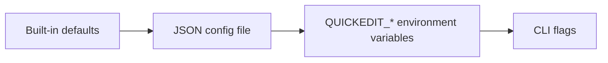

Example:

```bash
QUICKEDIT_MOTION_BACKEND=opencv quickedit recording.mp4 --motion-backend ffmpeg
```

The actual backend will be `ffmpeg`, because the CLI flag has higher priority
than the environment variable.

## Stage-by-stage flow

### 1. Read the command

QuickEdit first reads:

- Input paths, like `recording.mp4`.
- CLI flags, like `--dry-run` or `--motion-backend ffmpeg`.
- Optional JSON config from `--config settings.json`.
- Optional environment variables like `QUICKEDIT_WHISPER_MODEL=small`.

Then it builds an internal `PipelineConfig` object. That object is just the full
set of settings for one input video.

### 2. Validate input and output

QuickEdit checks:

- The input file exists.
- The input is a file, not a folder.
- `ffmpeg` is available on your system.
- `ffprobe` is available on your system.
- The video has an audio stream.
- The output path is not the same as the input path.
- The output file does not already exist unless you pass `--overwrite`.

This avoids accidentally destroying your original video or starting a long
analysis that cannot render later.

### 3. Inspect the video

QuickEdit calls FFprobe to learn:

| Metadata | Why QuickEdit needs it |
| --- | --- |
| FPS | To convert seconds into frame numbers. |
| Duration | To build the timeline and progress output. |
| Frame count | To make detector arrays the right length. |
| Width and height | To record source metadata in timeline JSON. |
| Audio stream exists | Speech detection and audio rendering need audio. |

Jargon:

- **FFprobe**: A tool that reads media information without editing the file.
- **FPS**: Frames per second. A 60 fps video has 60 images per second.
- **Frame**: One image inside a video.
- **Stream**: A track inside a media file, such as video, audio, or subtitles.

### 4. Decide which analysis is needed

QuickEdit avoids work when possible.

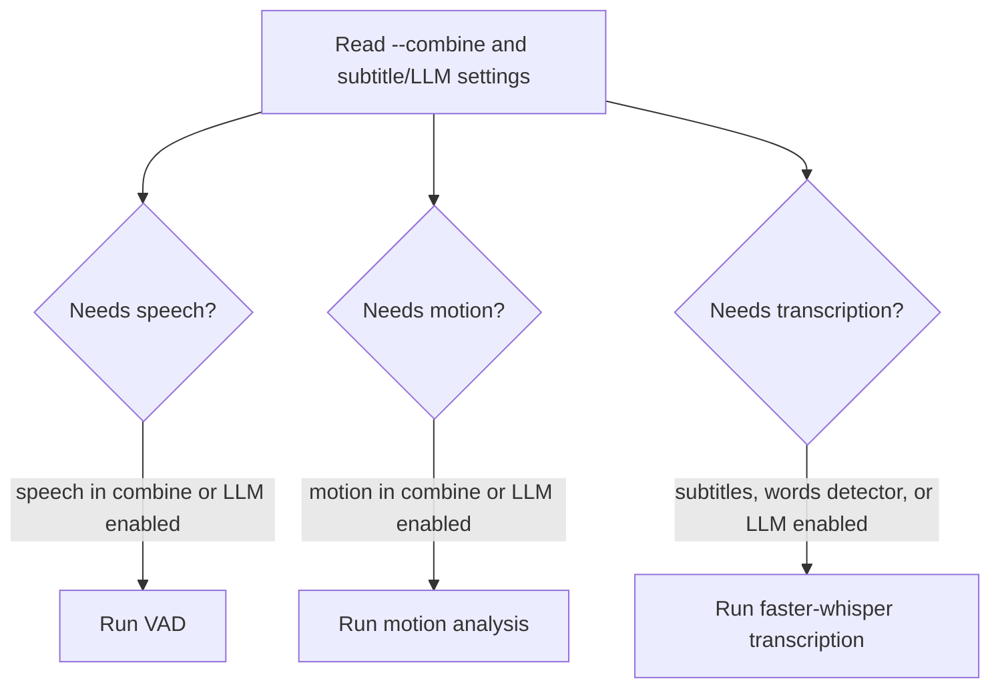

Examples:

```bash
quickedit recording.mp4 --combine speech --subtitle-style none
```

This skips motion analysis and transcription. It only needs speech detection.

```bash
quickedit recording.mp4 --combine motion --subtitle-style none
```

This skips speech detection and transcription. It only needs motion analysis.

```bash
quickedit recording.mp4
```

The default combine expression is `or:speech,motion`, and the default subtitle
style is `fancy`, so QuickEdit usually runs speech detection, motion analysis,
and transcription.

### 5. Speech detection

Speech detection answers this question:

> Which video frames contain speech?

Flow:

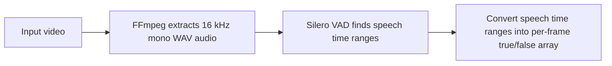

Jargon:

- **VAD**: Voice Activity Detection. It detects whether audio contains speech.
- **16 kHz mono WAV**: A simple audio format used for analysis. 16 kHz means
  16,000 audio samples per second. Mono means one audio channel.
- **Boolean array**: A list of true/false values. In QuickEdit, one value maps
  to one video frame.

Important flag:

```bash
--vad-threshold 0.5
```

Lower values are more sensitive and can mark more audio as speech. Higher values
are stricter and can cut more aggressively.

### 6. Motion analysis

Motion analysis answers this question:

> Which video frames contain visual activity?

This matters for screen recordings. For example, you might be silently typing or
drawing. Speech detection alone would cut that, but motion detection can keep it.

Flow:

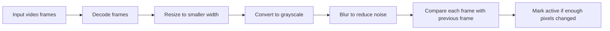

Default backend:

```bash
--motion-backend ffmpeg
```

QuickEdit uses the FFmpeg motion backend by default because benchmarks on long
screen recordings showed the same activity percentage with much faster analysis.

Motion backend choices:

| Backend | What it does | When to use it |
| --- | --- | --- |
| `ffmpeg` | FFmpeg decodes scaled grayscale frames, then QuickEdit compares them. | Default. Usually fastest when video decoding is the bottleneck. |
| `opencv` | OpenCV decodes and processes frames in one path. | Good fallback when debugging backend differences. |
| `opencv-parallel` | OpenCV path with parallel preprocessing workers. | Useful when OpenCV preprocessing is CPU-heavy. |

Important flags:

```bash
--motion-threshold 0.02
--motion-pixel-threshold 10
--motion-frame-skip 1
--motion-workers 4
```

How to choose motion values:

| Flag | Good starting value | Try lower when | Try higher when |
| --- | --- | --- | --- |
| `--motion-threshold` | `0.02` | Subtle cursor movement, writing, drawing, or scrolling is being cut. | Static screens, camera noise, or compression noise are being kept as motion. |
| `--motion-pixel-threshold` | `10` | Low-contrast UI changes are missed. | Tiny color flicker, video grain, or compression noise is counted as motion. |
| `--motion-frame-skip` | `1` | Use lower values when short visual actions matter. `1` is already the lowest. | Analysis is slow and you can accept missing very brief motion. Try `2` or `3`. |
| `--motion-workers` | `4` | Usually do not lower unless your machine is overloaded. | With `--motion-backend opencv-parallel`, try `6` or `8` on CPUs with many cores. |

Practical presets:

```bash
# Most screen recordings. Accurate, current default backend.
quickedit tutorial.mp4 --motion-backend ffmpeg --motion-frame-skip 1

# Long screen recordings where speed matters.
quickedit tutorial.mp4 --motion-backend ffmpeg --motion-frame-skip 2

# Very long recordings where tiny movements are not important.
quickedit tutorial.mp4 --motion-backend ffmpeg --motion-frame-skip 3

# Subtle motion is getting cut.
quickedit tutorial.mp4 --motion-threshold 0.01 --motion-pixel-threshold 6

# Too much idle video is being kept.
quickedit tutorial.mp4 --motion-threshold 0.04 --motion-pixel-threshold 15

# OpenCV parallel backend on a CPU with enough cores.
quickedit tutorial.mp4 --motion-backend opencv-parallel --motion-workers 6
```

Jargon:

- **Threshold**: A cutoff value. If a measured value is above the threshold,
  QuickEdit treats it as active.
- **Pixel**: One tiny colored dot in a video frame.
- **Grayscale**: Black-and-white image data. It is cheaper to analyze than full
  color.
- **Blur**: A smoothing step that reduces tiny visual noise.
- **Frame skip**: Analyze every Nth frame. `3` means analyze frame 0, 3, 6, 9,
  and so on, then fill in the gaps.

### 7. Transcription

Transcription answers this question:

> What words were spoken, and when were they spoken?

Flow:

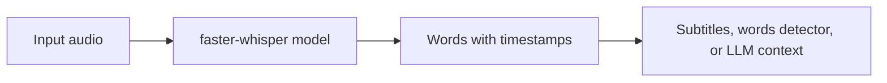

Transcription runs when:

- Subtitles are enabled.
- `--combine` references `words`.
- LLM editing is enabled with `--llm`.

It is skipped when it is not needed.

Jargon:

- **Whisper**: A speech-to-text model family.
- **faster-whisper**: The Python library QuickEdit uses to run Whisper.
- **Model size**: A larger model can be more accurate but slower.
- **Timestamp**: A time marker, such as word starts at 12.4 seconds.

Important flags:

```bash
--whisper-model base
--device cpu
--whisper-compute-type int8
--language en
```

### 8. Combine the detectors

Each detector creates a per-frame true/false list:

| Detector | True means |
| --- | --- |
| `speech` | Speech is present in this frame. |
| `motion` | Visual activity is present in this frame. |
| `words` | A transcribed word overlaps this frame. |

`--combine` tells QuickEdit how to merge these lists.

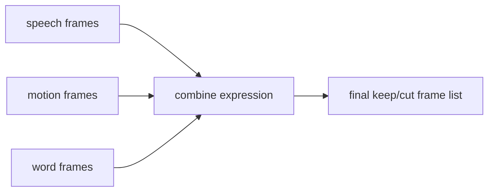

Common combine modes:

| Command | Meaning |
| --- | --- |
| `--combine speech` | Keep frames with speech. |
| `--combine motion` | Keep frames with motion. |
| `--combine or:speech,motion` | Keep frames with speech or motion. This is the default. |
| `--combine and:speech,motion` | Keep only frames with both speech and motion. |
| `--combine words` | Keep frames where transcribed words appear. |

Jargon:

- **OR**: True if either side is true.
- **AND**: True only if both sides are true.
- **Detector**: A method that decides whether a frame should be kept.
- **Keep mask**: The final true/false list saying which frames to keep.

### 9. Apply margin and smoothing

Raw detector output can create cuts that feel too sharp or too jumpy. QuickEdit
cleans this up.

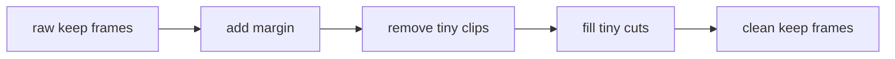

Important flags:

```bash
--margin 0.2
--minclip 0.1
--mincut 0.2
```

What they do:

| Flag | Meaning | Example |
| --- | --- | --- |
| `--margin 0.2` | Keep 0.2 seconds before and after each keep section. | Prevents clipped first/last words. |
| `--minclip 0.1` | Remove keep clips shorter than 0.1 seconds. | Avoids tiny flashes. |
| `--mincut 0.2` | Fill cut gaps shorter than 0.2 seconds. | Avoids jumpy micro-cuts. |

Jargon:

- **Clip**: A section of the source video that appears in the output.
- **Cut**: A section removed from the output.
- **Smoothing**: Cleaning up very short keep/cut regions.

### 10. Build timeline JSON

The timeline is the edit plan. It says:

- Source video path.
- Source metadata.
- Which source time ranges become output clips.
- Which source time ranges are cut.

Example shape:

```json
{
  "source": "/path/recording.mp4",
  "fps": 60.0,
  "duration": 120.0,
  "width": 1920,
  "height": 1080,
  "clips": [
    { "src_start": 0.0, "src_end": 10.5, "dst_start": 0.0 }
  ],
  "cuts": [
    { "src_start": 10.5, "src_end": 14.0, "reason": "silence" }
  ]
}
```

Jargon:

- **Timeline**: The edit plan.
- **Source time**: Time in the original video.
- **Destination time**: Time in the edited output video.
- **Sidecar file**: A helper file written beside the output video.

### 11. Optional LLM editing

LLM editing is off by default. It only runs when you pass:

```bash
--llm
```

Flow:

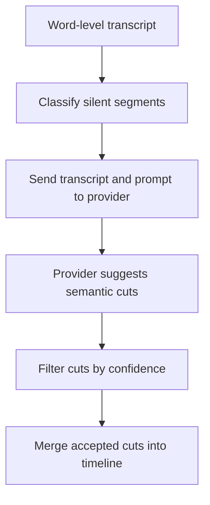

QuickEdit does not upload the source video to the LLM provider. It sends
transcript data and editing context.

Important flags:

```bash
--llm
--llm-model claude-sonnet-4-20250514
--prompt "Remove filler words and long tangents"
--prompt-template tutorial
--prompt-file prompt.txt
--confidence 0.7
--silent-segment-min-duration 0.5
```

Jargon:

- **LLM**: Large Language Model. A text AI model such as Claude or Gemini.
- **Semantic cut**: A cut based on meaning, not just silence or motion.
- **Confidence**: How sure the LLM says it is about a suggested cut.
- **Provider**: The company/API that runs the model.

### 12. Generate subtitles

Subtitles require transcription. QuickEdit writes subtitles before rendering so
FFmpeg can burn them into the video.

Subtitle styles:

| Style | Output file | Meaning |
| --- | --- | --- |
| `fancy` | `.ass` | Word-highlight subtitles. |
| `simple` | `.srt` | Plain portable subtitles. |
| `none` | no subtitle file | Skip subtitles and transcription unless needed elsewhere. |

Important flags:

```bash
--subtitle-style fancy
--subtitle-font Arial
--subtitle-size 20
--subtitle-silence-gap 0.7
```

Jargon:

- **ASS subtitles**: Advanced subtitle format that supports styling and word
  highlighting.
- **SRT subtitles**: Simple subtitle format supported by many video tools.
- **Burn in**: Draw subtitles directly into the video image.

### 13. Render with FFmpeg

Rendering creates the final edited video.

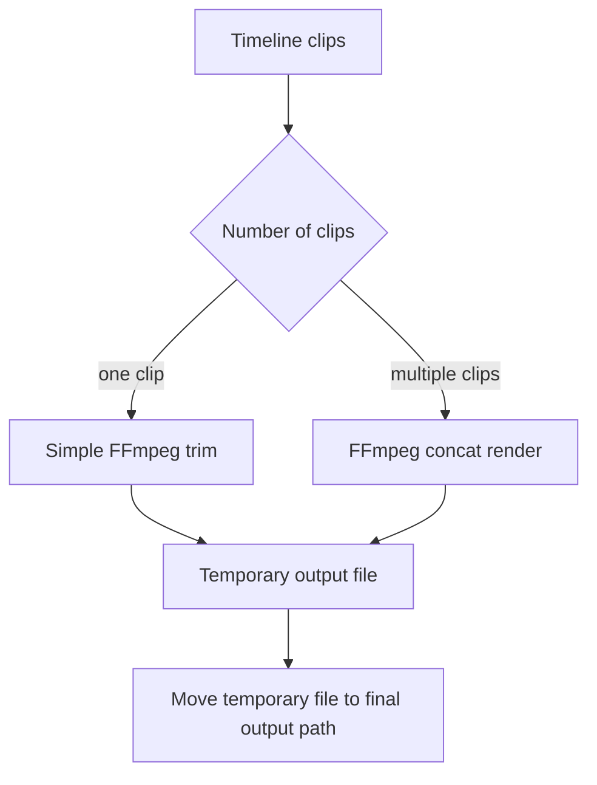

QuickEdit writes to a temporary output first. If rendering succeeds, it moves
the temporary file into the final output path. This avoids leaving a half-written
output file if FFmpeg fails.

Important render flags:

```bash
--codec libx264
--crf 18
--preset medium
--audio-codec aac
--audio-bitrate 192k
```

Jargon:

- **Codec**: The compression format, such as H.264 via `libx264`.
- **CRF**: Constant Rate Factor. Lower values mean better quality and larger
  files. Higher values mean smaller files and lower quality.
- **Preset**: Encoder speed setting. Faster presets render faster but may make
  larger files.
- **Bitrate**: How much data per second is used for audio or video.
- **Concat**: Join multiple video clips together.

## Flag reference in plain language

### Input and output flags

| Flag | Default | What it does | When to use it |
| --- | --- | --- | --- |
| `INPUT_PATHS` | required | Video file or files to edit. | Always required. |
| `-o, --output PATH` | `<input>_edited.ext` | Sets output file for one input, or output folder for multiple inputs. | Use when you want a specific output location. |
| `--overwrite` | off | Allows replacing an existing output video. | Use only when you intentionally want to replace a file. |
| `--dry-run` | off | Runs analysis and writes sidecars, but skips rendering. | Use before a long render or when tuning settings. |

Value guide:

```bash
# Safest first run. No final video render.
quickedit recording.mp4 --dry-run

# Pick an output file.
quickedit recording.mp4 -o recording-clean.mp4

# Batch mode: -o is an output folder.
quickedit recordings/*.mp4 -o edited/

# Replace an existing output on purpose.
quickedit recording.mp4 -o recording-clean.mp4 --overwrite
```

Use `--dry-run` whenever you are testing thresholds, margins, prompts, or a new
video type. Use `--overwrite` only after checking the output path.

### Config and environment flags

| Flag | Default | What it does | When to use it |
| --- | --- | --- | --- |
| `--config FILE` | none | Loads settings from a JSON file. | Use for repeatable presets. |
| `QUICKEDIT_*` env vars | none | Sets options from the shell. | Use for defaults you want often. |

Example config:

```json
{
  "combine_expr": "or:speech,motion",
  "motion_backend": "ffmpeg",
  "motion_frame_skip": 2,
  "subtitle_style": "none"
}
```

### Speech and transcription flags

| Flag | Default | What it does | When to use it |
| --- | --- | --- | --- |
| `--whisper-model TEXT` | `base` | Chooses the speech-to-text model size. | Use `tiny` for faster, `small` or larger for more accuracy. |
| `--device TEXT` | `cpu` | Chooses CPU or CUDA for Whisper. | Use `cuda` if your GPU setup supports it. |
| `--whisper-compute-type VALUE` | auto | Chooses numeric precision for Whisper. | Use `int8` on CPU, `float16` on CUDA. |
| `--language TEXT` | auto | Sets language code like `en`. | Use when auto-detect picks the wrong language. |
| `--vad-threshold FLOAT` | `0.5` | Controls speech detection sensitivity. | Lower if speech is missed; higher if noise is kept. |

#### Speech and transcription value guide

##### `--vad-threshold`

Default:

```bash
--vad-threshold 0.5
```

Use these values:

| Value | Behavior | Use when |
| --- | --- | --- |
| `0.25` to `0.35` | Very sensitive. | Quiet speech is being cut. |
| `0.4` | Sensitive. | Some words are missed. |
| `0.5` | Balanced default. | Normal microphone speech. |
| `0.6` to `0.7` | Stricter. | Keyboard noise, fan noise, or music is being treated as speech. |
| `0.8` or higher | Very strict. | Only clear speech should be kept. |

If speech is cut off, first try increasing `--margin`. If speech is completely
missed, lower `--vad-threshold`.

##### `--whisper-model`

Use this only when transcription is needed for subtitles, `words`, or LLM
editing.

| Value | Speed | Accuracy | Use when |
| --- | --- | --- | --- |
| `tiny` | Fastest | Lowest | Quick draft subtitles or weak CPU. |
| `base` | Fast | Good enough for many videos | Default. Good first choice. |
| `small` | Medium | Better | You want better subtitles and can wait longer. |
| `medium` | Slow | Higher | Accuracy matters more than speed. |
| `large-v3` | Slowest | Highest | Final subtitles on strong hardware. |

##### `--device` and `--whisper-compute-type`

CPU-safe:

```bash
quickedit recording.mp4 --device cpu --whisper-compute-type int8
```

CUDA:

```bash
quickedit recording.mp4 --device cuda --whisper-compute-type float16
```

Use CPU mode when setup simplicity matters. Use CUDA only if your GPU, drivers,
and faster-whisper installation are already working.

##### `--language`

Default is auto-detect. Set it when auto-detect chooses the wrong language:

```bash
quickedit recording.mp4 --language en
```

### Motion flags

| Flag | Default | What it does | When to use it |
| --- | --- | --- | --- |
| `--motion-threshold FLOAT` | `0.02` | Required fraction of changed pixels for motion. | Lower if subtle motion is missed; higher if noise is kept. |
| `--motion-pixel-threshold INTEGER` | `10` | Pixel brightness change needed to count as changed. | Raise if compression noise causes false motion. |
| `--motion-frame-skip INTEGER` | `1` | Analyzes every Nth frame. | Use `2` or `3` to speed up long screen recordings. |
| `--motion-backend VALUE` | `ffmpeg` | Chooses `ffmpeg`, `opencv`, or `opencv-parallel`. | Keep `ffmpeg` unless benchmarks show another backend is better. |
| `--motion-workers INTEGER` | `4` | Worker count for `opencv-parallel`. | Use with `--motion-backend opencv-parallel`. |

#### Motion value guide

These flags control the biggest performance and quality tradeoff for screen
recordings.

##### `--motion-threshold`

Default:

```bash
--motion-threshold 0.02
```

Meaning: after comparing two frames, at least 2% of pixels must count as changed
before QuickEdit marks the frame as visual activity.

Use these values:

| Value | Behavior | Use when |
| --- | --- | --- |
| `0.005` | Very sensitive. Keeps tiny visual changes. | Cursor movement, handwriting, or small UI changes are being cut. |
| `0.01` | Sensitive. | Screen recordings have subtle visual activity. |
| `0.02` | Balanced default. | Normal tutorials, coding videos, slides, and demos. |
| `0.04` | Stricter. | Too much idle screen is being kept. |
| `0.08` or higher | Very strict. | Only large motion like fast scrolling should count. |

If QuickEdit cuts silent typing or drawing, lower this value. If QuickEdit keeps
static screens, raise it.

##### `--motion-pixel-threshold`

Default:

```bash
--motion-pixel-threshold 10
```

Meaning: one pixel must change brightness by at least 10 levels, from a possible
range of 0 to 255, before it counts as changed.

Use these values:

| Value | Behavior | Use when |
| --- | --- | --- |
| `3` to `6` | More sensitive to tiny color/brightness changes. | Low-contrast UI changes are missed. |
| `10` | Balanced default. | Normal screen recordings. |
| `15` to `25` | Ignores smaller brightness changes. | Video compression noise or display flicker is counted as motion. |
| `30` or higher | Very strict. | Only strong visual changes should count. |

This is different from `--motion-threshold`: pixel threshold decides whether one
pixel changed; motion threshold decides whether enough pixels changed.

##### `--motion-frame-skip`

Default:

```bash
--motion-frame-skip 1
```

Meaning: analyze every Nth frame. `1` means analyze every frame. `2` means every
other frame. `3` means every third frame.

Use these values:

| Value | Speed | Accuracy | Use when |
| --- | --- | --- | --- |
| `1` | Slowest | Best | Short actions matter, such as cursor movement, typing, drawing, or quick UI changes. |
| `2` | Faster | Usually still good | Long screen recordings with slower visual changes. |
| `3` | Much faster | Can miss brief motion | Long lectures, slides, or demos where tiny motion is not important. |
| `5` or higher | Fastest | Risky | Only use after a dry run proves cuts still look right. |

If you are processing a long 60 fps recording, `--motion-frame-skip 2` is often
a good first speed upgrade.

##### `--motion-backend`

Default:

```bash
--motion-backend ffmpeg
```

Use these values:

| Value | Use when |
| --- | --- |
| `ffmpeg` | Default. Usually fastest on long screen recordings and high-resolution files. |
| `opencv` | Use as a baseline or fallback if you suspect FFmpeg backend differences. |
| `opencv-parallel` | Use when OpenCV works better for a file and CPU preprocessing is the bottleneck. |

Benchmark your own files:

```bash
uv run python scripts/benchmark_motion_backends.py recordings/*.mp4 --repeat 3 --warmup
```

If all backends show similar `activity_pct`, choose the fastest median time.

##### `--motion-workers`

Default:

```bash
--motion-workers 4
```

Meaning: number of worker threads for `--motion-backend opencv-parallel`.
This flag does not matter for `ffmpeg` or plain `opencv`.

Use these values:

| Value | Use when |
| --- | --- |
| `2` | Older laptop or you want to keep the machine responsive. |
| `4` | Good default for many machines. |
| `6` to `8` | CPU has enough cores and benchmark improves. |
| More than `8` | Only if benchmarks prove it helps. Too many workers can slow things down. |

Always benchmark `opencv-parallel`; more workers do not automatically mean
faster results.

### Editing logic flags

| Flag | Default | What it does | When to use it |
| --- | --- | --- | --- |
| `--combine TEXT` | `or:speech,motion` | Chooses how detectors decide what to keep. | Use `speech` for speech-only trimming or default for screen recordings. |
| `--margin FLOAT` | `0.2` | Adds time around keep regions. | Increase if words are clipped. |
| `--minclip FLOAT` | `0.1` | Removes tiny keep clips. | Increase if output has tiny flashes. |
| `--mincut FLOAT` | `0.2` | Fills tiny cut gaps. | Increase if output has jumpy micro-cuts. |

#### Editing value guide

Use these when the cuts feel wrong:

| Flag | Default | Try this | When |
| --- | --- | --- | --- |
| `--margin` | `0.2` | `0.3` to `0.5` | First or last words feel clipped, or cuts feel too abrupt. |
| `--margin` | `0.2` | `0.1` | Output keeps too much silence around speech. |
| `--minclip` | `0.1` | `0.2` to `0.5` | Tiny kept flashes appear in the output. |
| `--mincut` | `0.2` | `0.4` to `0.8` | Output has jumpy tiny cuts or micro-pauses. |
| `--mincut` | `0.2` | `0.1` | QuickEdit keeps too many short pauses that you wanted removed. |

Conservative edit:

```bash
quickedit recording.mp4 --margin 0.4 --mincut 0.5 --minclip 0.2
```

Aggressive edit:

```bash
quickedit recording.mp4 --margin 0.1 --mincut 0.1 --minclip 0.1
```

### LLM flags

| Flag | Default | What it does | When to use it |
| --- | --- | --- | --- |
| `--llm` | off | Enables semantic LLM editing. | Use only when you accept transcript data leaving your machine. |
| `--no-llm` | on | Keeps LLM editing disabled. | Default local-first behavior. |
| `--llm-model TEXT` | `claude-sonnet-4-20250514` | Chooses Claude or Gemini model by name. | Use model supported by your provider key. |
| `--prompt TEXT` | none | Inline custom editing instructions. | Use for one-off instructions. |
| `--prompt-template VALUE` | none | Uses `dsa`, `tutorial`, or `lecture` prompt. | Use for common content types. |
| `--prompt-file PATH` | none | Reads prompt from a file. | Use for reusable detailed prompts. |
| `--confidence FLOAT` | `0.7` | Minimum confidence for LLM cuts. | Raise for conservative cuts. |
| `--silent-segment-min-duration FLOAT` | `0.5` | Minimum silence length sent for LLM classification. | Increase to ignore tiny pauses. |

#### LLM value guide

Use LLM editing only after a normal dry run works:

```bash
quickedit recording.mp4 --dry-run --llm
```

Useful values:

| Flag | Default | Try this | When |
| --- | --- | --- | --- |
| `--confidence` | `0.7` | `0.85` to `0.95` | LLM cuts too much or you want conservative edits. |
| `--confidence` | `0.7` | `0.5` to `0.65` | LLM is too cautious and misses obvious tangents. |
| `--silent-segment-min-duration` | `0.5` | `1.0` to `2.0` | Tiny pauses are cluttering LLM context. |
| `--prompt-template` | none | `tutorial` | Editing lessons, demos, walkthroughs. |
| `--prompt-template` | none | `lecture` | Longer spoken explanations. |
| `--prompt-template` | none | `dsa` | Data structures and algorithms videos. |

Prompt examples:

```bash
quickedit recording.mp4 --llm --prompt "Remove repeated explanations but keep all code walkthrough steps."
quickedit recording.mp4 --llm --prompt-file editing-rules.txt
```

Raise `--confidence` before changing the prompt if the LLM is making risky cuts.

### Subtitle flags

| Flag | Default | What it does | When to use it |
| --- | --- | --- | --- |
| `--subtitle-style VALUE` | `fancy` | Chooses `fancy`, `simple`, or `none`. | Use `none` to skip subtitles. |
| `--subtitle-font TEXT` | `Arial` | Font for ASS subtitles. | Use to match your video style. |
| `--subtitle-size INTEGER` | `20` | Font size for ASS subtitles. | Increase if subtitles are too small. |
| `--subtitle-silence-gap FLOAT` | `0.7` | Gap that starts a new subtitle group. | Increase for fewer subtitle chunks. |

#### Subtitle value guide

| Flag | Default | Try this | When |
| --- | --- | --- | --- |
| `--subtitle-style` | `fancy` | `none` | You want the fastest local trim and no subtitles. |
| `--subtitle-style` | `fancy` | `simple` | You want portable `.srt` subtitles. |
| `--subtitle-size` | `20` | `24` to `32` | Text is too small for 1080p or mobile viewing. |
| `--subtitle-size` | `20` | `16` to `18` | Text covers too much of the video. |
| `--subtitle-silence-gap` | `0.7` | `1.0` to `1.5` | Subtitles change too often. |
| `--subtitle-silence-gap` | `0.7` | `0.3` to `0.5` | Subtitles stay grouped for too long. |

Fastest no-subtitle workflow:

```bash
quickedit recording.mp4 --subtitle-style none
```

### Render flags

| Flag | Default | What it does | When to use it |
| --- | --- | --- | --- |
| `--codec TEXT` | `libx264` | Video codec for FFmpeg. | Use `libx264` for compatibility. |
| `--crf INTEGER` | `18` | Quality level from 0 to 51. Lower is better. | Use 18 to 23 for normal use. |
| `--preset VALUE` | `medium` | Encoding speed preset. | Use `fast` for faster renders, `slow` for smaller files. |
| `--audio-codec TEXT` | `aac` | Audio codec. | `aac` is widely compatible. |
| `--audio-bitrate TEXT` | `192k` | Audio quality target. | Raise for higher audio quality. |

#### Render value guide

##### `--crf`

Default:

```bash
--crf 18
```

Use these values:

| Value | Quality | File size | Use when |
| --- | --- | --- | --- |
| `16` to `18` | Very high | Larger | Final high-quality export. |
| `20` to `23` | Good | Smaller | Normal sharing or draft output. |
| `24` to `28` | Lower | Much smaller | Quick preview files. |

Lower CRF means better quality. It is the opposite of many quality sliders.

##### `--preset`

Default:

```bash
--preset medium
```

Use these values:

| Value | Render speed | File size efficiency | Use when |
| --- | --- | --- | --- |
| `ultrafast` or `veryfast` | Fastest | Larger files | Drafts and tests. |
| `fast` | Fast | Reasonable | Everyday quick exports. |
| `medium` | Balanced | Balanced | Default. |
| `slow` | Slower | Smaller files | Final export when time is acceptable. |

Preset mostly affects encoding speed and output size, not the cut decisions.

##### Audio values

```bash
--audio-codec aac --audio-bitrate 192k
```

Use `192k` for normal speech videos. Use `256k` or `320k` if music/audio quality
matters. For voice-only screen recordings, `128k` is often enough.

### Cache and logging flags

| Flag | Default | What it does | When to use it |
| --- | --- | --- | --- |
| `--no-cache` | off | Disables cache reads and writes. | Use when debugging fresh analysis. |
| `--clear-cache` | off | Deletes cached analysis before running. | Use after changing inputs or when cache seems wrong. |
| `-v, --verbose` | off | Shows detailed logs and errors. | Use when debugging failures. |
| `--version` | n/a | Prints QuickEdit version. | Use to confirm installed version. |
| `--help` | n/a | Prints CLI help. | Use to see available options. |

#### Cache and logging value guide

Use cache normally. It saves time when rerunning the same video.

```bash
# Normal: use cache.
quickedit recording.mp4

# Delete old analysis first.
quickedit recording.mp4 --clear-cache

# Ignore cache completely for this run.
quickedit recording.mp4 --no-cache

# Show detailed logs.
quickedit recording.mp4 --verbose
```

Use `--clear-cache` after changing analysis behavior and wanting a clean run.
Use `--no-cache` when debugging whether cached data is hiding a problem.

## Common workflows

### Preview the edit without rendering

```bash
quickedit recording.mp4 --dry-run
```

Use this first. It is faster than rendering and shows what would be cut.

### Fast speech-only trimming

```bash
quickedit lecture.mp4 --combine speech --subtitle-style none
```

This skips motion analysis and transcription. Good for talking videos where
silent visual activity does not matter.

### Screen recording with silent activity

```bash
quickedit tutorial.mp4 --combine or:speech,motion
```

This keeps speech and screen activity. It is useful for tutorials where you type,
draw, scroll, or code without speaking.

### Faster long screen recording

```bash
quickedit tutorial.mp4 --motion-backend ffmpeg --motion-frame-skip 2
```

This uses the default FFmpeg backend and analyzes every other frame.

### Disable subtitles

```bash
quickedit recording.mp4 --subtitle-style none
```

This avoids transcription unless another feature needs it.

### Render with conservative cuts

```bash
quickedit recording.mp4 --margin 0.4 --mincut 0.5
```

This keeps more context around the kept sections and avoids very short cut gaps.

## What happens in batch mode

```bash
quickedit video1.mp4 video2.mp4 video3.mp4 -o edited/
```

Flow:

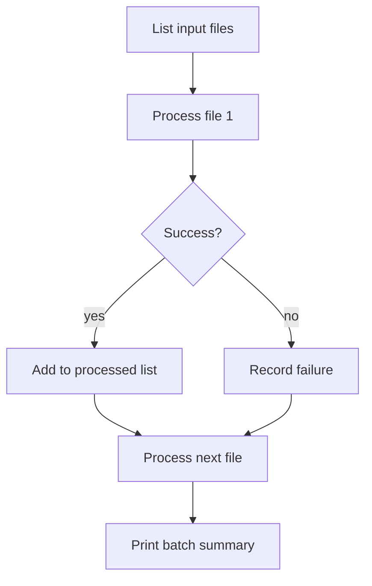

If one video fails, QuickEdit reports it and continues with the remaining files.

## How QuickEdit uses cache

QuickEdit caches expensive analysis:

- Speech detection.
- Motion detection.
- Transcription.

Cache keys include:

- Input path.
- Input modification time.
- Input file size.
- Analysis method.
- Relevant analysis settings.

Changing `--crf` does not invalidate motion analysis. Changing
`--motion-backend` does, because the motion analysis method changed.

## How it actually edits the video

QuickEdit does not edit the original file. It creates a new output file.

Conceptually, it does this:

```text
Original:
  [keep 0.0-8.2] [cut 8.2-12.0] [keep 12.0-30.0]

Output:
  [0.0-8.2 from source] + [12.0-30.0 from source]
```

The timeline JSON stores this plan. FFmpeg then trims and joins the kept source
sections into the final output video.

## Troubleshooting mental model

If the output is wrong, ask which stage made the wrong decision:

| Symptom | Likely stage | Try |
| --- | --- | --- |
| Speech is cut off | Speech detection or margin | Lower `--vad-threshold`, raise `--margin`. |
| Silent screen work is cut | Motion detection or combine | Use `--combine or:speech,motion`, lower `--motion-threshold`. |
| Too much idle screen is kept | Motion threshold too sensitive | Raise `--motion-threshold` or `--motion-pixel-threshold`. |
| Output has jumpy tiny cuts | Smoothing | Raise `--mincut`. |
| Tiny flashes appear | Smoothing | Raise `--minclip`. |
| Subtitles are unwanted | Subtitle setting | Use `--subtitle-style none`. |
| Analysis is slow | Motion or transcription | Use `--motion-frame-skip 2`, `--combine speech`, or `--subtitle-style none`. |
| LLM makes too many cuts | LLM confidence/prompt | Raise `--confidence` or improve the prompt. |

## Safe defaults

For most screen recordings:

```bash
quickedit recording.mp4 --combine or:speech,motion --motion-backend ffmpeg
```

For fastest speech-only trimming:

```bash
quickedit recording.mp4 --combine speech --subtitle-style none
```

For careful first use:

```bash
quickedit recording.mp4 --dry-run
```
